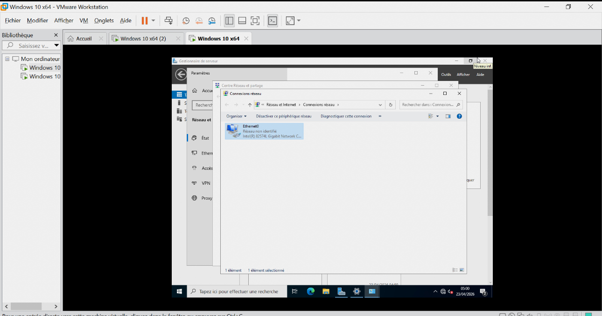

# Configuration DNS

## Vérification

- DNS installé automatiquement avec AD.

📸 Capture d’écran : DNS Manager


## Test

```powershell
ping techcorp.local
```

## Résultat

- Résolution DNS fonctionnelle.
