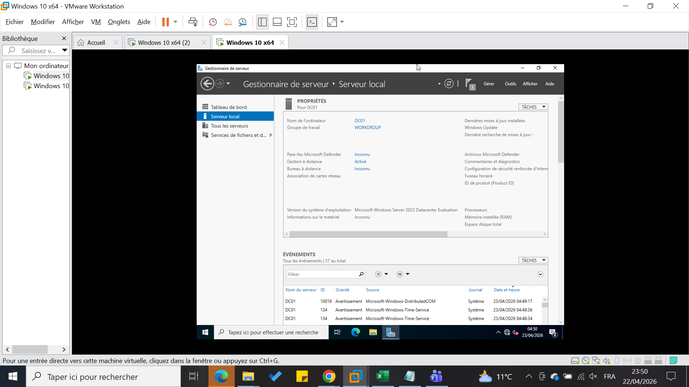
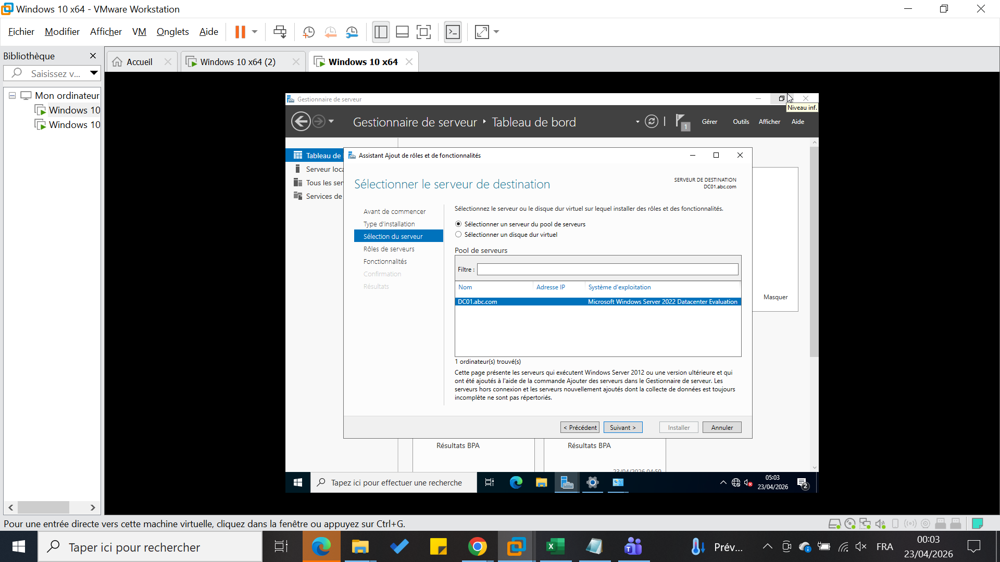

# Installation Active Directory (AD DS)

## Étapes

1. Ouvrir Server Manager.

2. Add Roles and Features.

3. Sélectionner :
   - Active Directory Domain Services

4. Installer.

## Résultat attendu

- Rôle AD DS installé.

