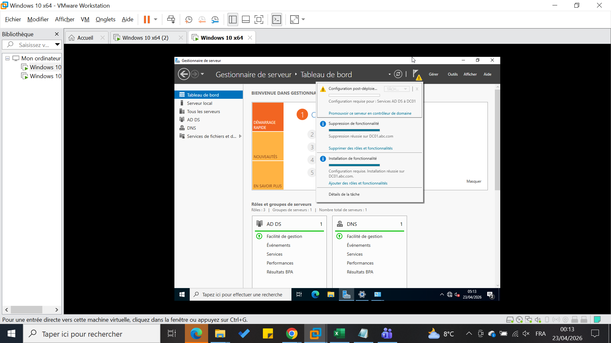
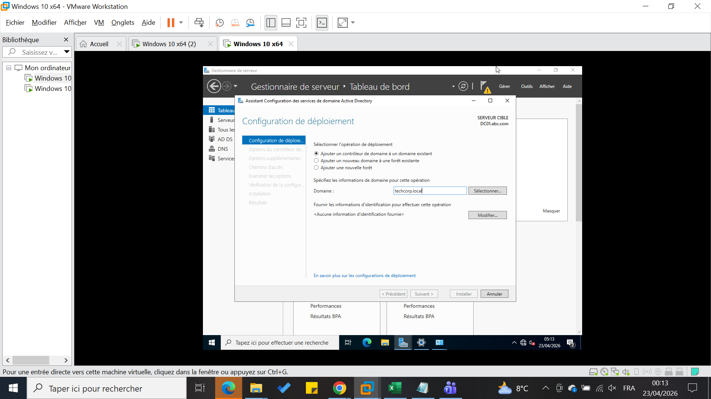
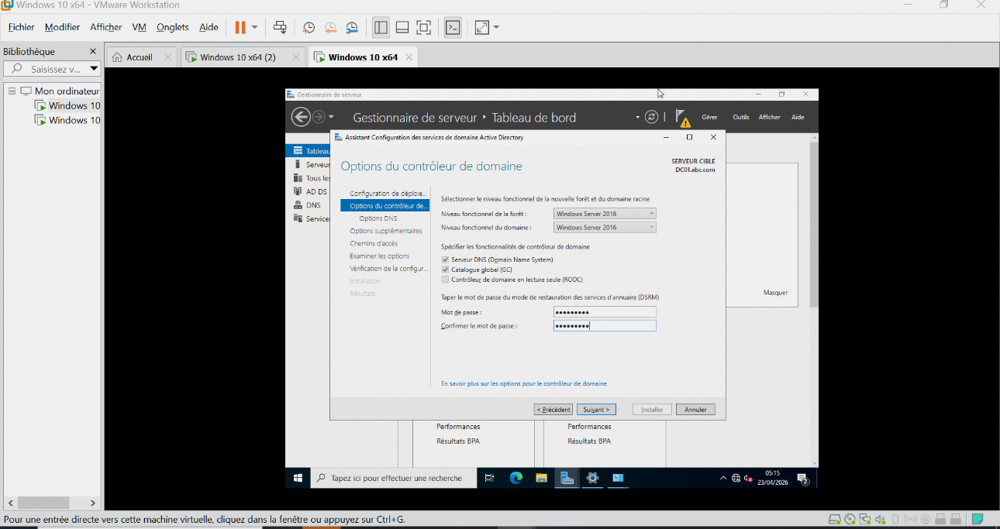
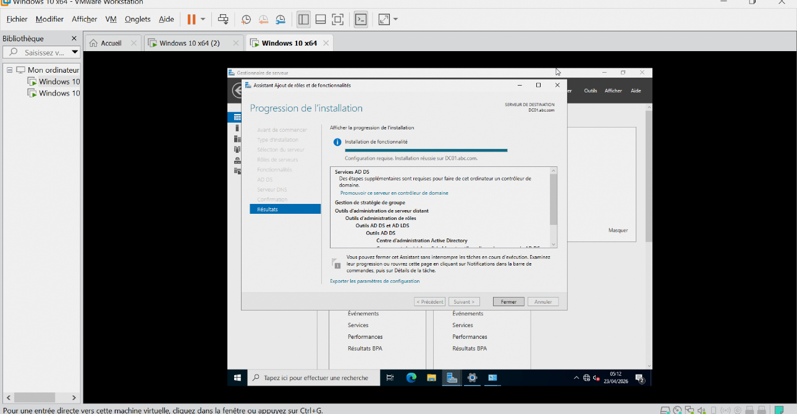
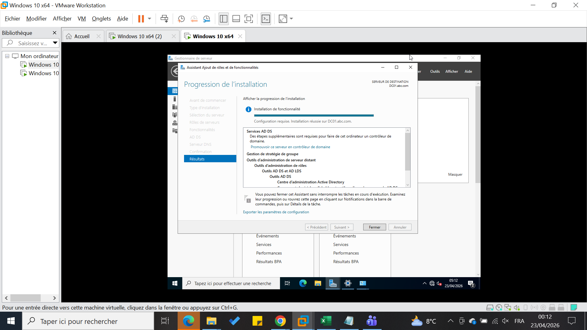
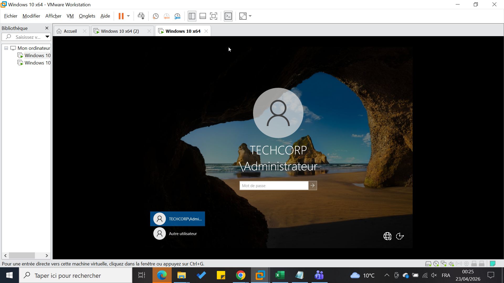

# Promotion en Domain Controller

## Étapes

1. Cliquer sur `Promote this server to a domain controller`.

2. Choisir :
   - Add a new forest
   - Domaine : `techcorp.local`
   

📸 Capture d’écran : configuration domaine

3. Définir le mot de passe DSRM.

4. Installer et redémarrer.

📸 Capture d'écran : installation terminée

## Résultat

 `DC01`.

- Le serveur devient.
.png)

