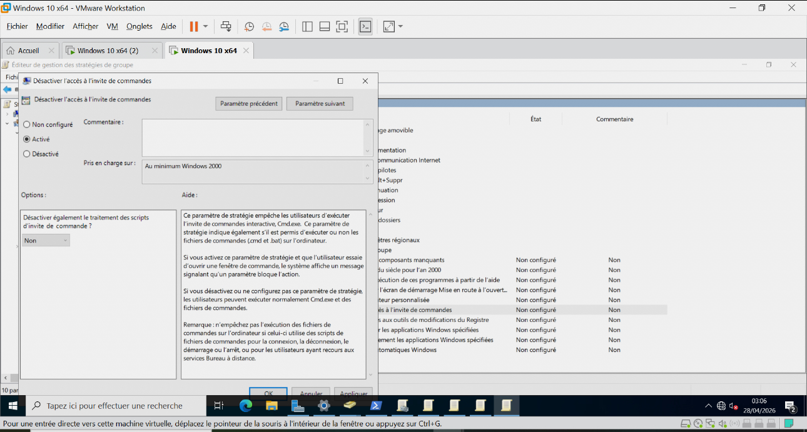
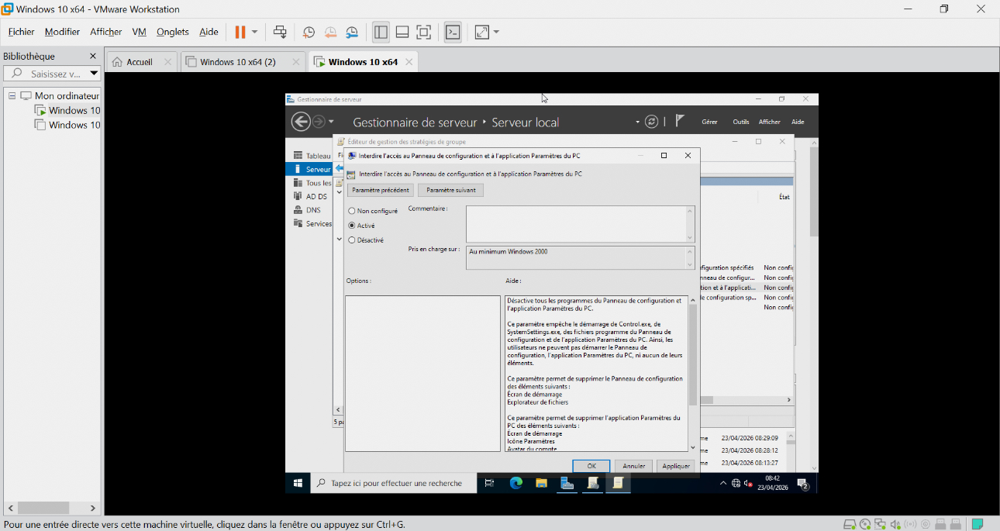

# GPO IT

## Paramètres

- Blocage CMD:

[Panneau config](./Images/activer_desactiver_lacces_a_linvite_commande.jpeg)

- Restriction panneau config:

[Panneau config](./Images/activer_option_dinterdir_lacces_au_panneu_de_configuration.jpeg)

## Résultat
- Environnement sécurisé IT
